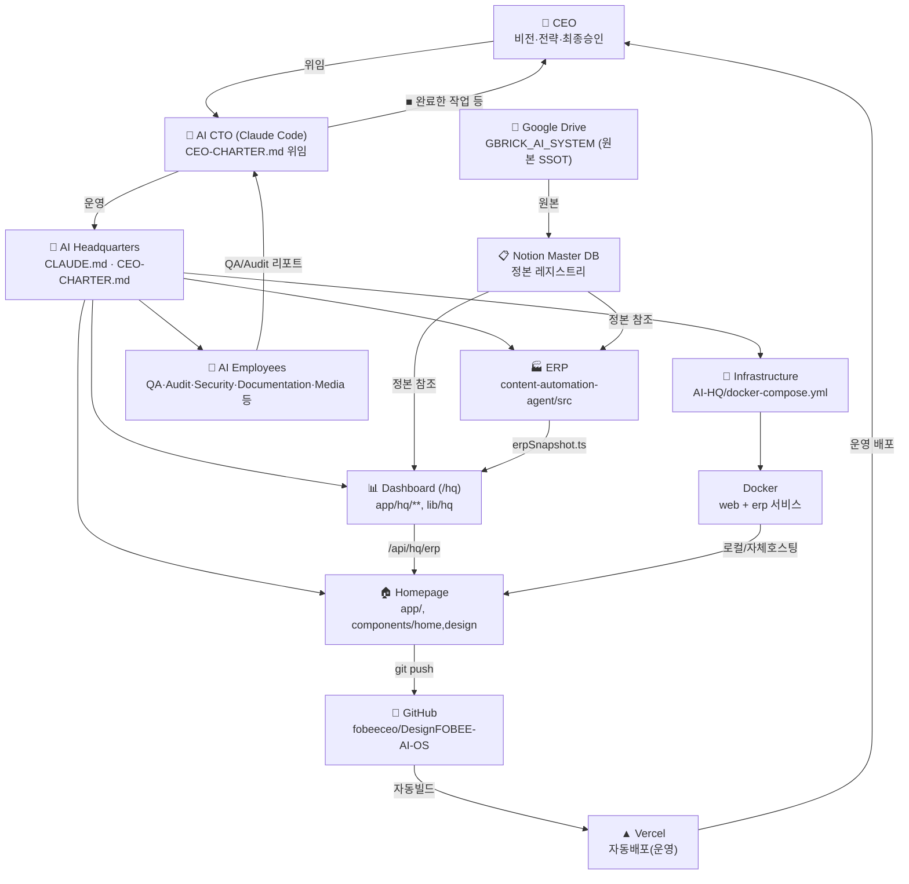

# SYSTEM-ARCHITECTURE — Mermaid Diagram

> CEO MASTER INITIALIZATION MISSION §7 산출물. 산문 설명은 [SYSTEM.md](SYSTEM.md) 참조(중복 회피, 본 문서는 다이어그램 전용).

## 범례
- **실선**: 데이터/제어 흐름(SSOT → 정본 → 참조 순).
- CEO↔CTO: 위임(CEO-CHARTER.md) / 보고(CEO-REPORT.md 형식).
- Drive→Notion→ERP/Dashboard: 3계층 SSOT 체인(§CEO-CHARTER §3).
- GitHub→Vercel: 운영 배포 파이프라인(현재 유일한 실제 프로덕션 경로).
- AI-HQ Docker: 로컬/자체호스팅 대안 경로(Vercel과 별개, 병행 가능 — [AI-HQ-ARCHITECTURE.md](AI-HQ-ARCHITECTURE.md) 참조).
